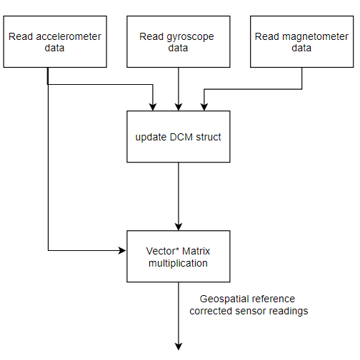

Formpal: A Prototype Microcontroller Solution for Weighlifting Injuries 
========

This algorithm compares a user's ideal exercise motion to any new
motion, giving them feedback if they've deviated from the ideal motion.
The project uses a Texas Instruments TM4C123GXL microcontroller
and an Invensense 9150 IMU communicating via I^2^C protocol. It is
intuitive and simple to use, requiring motion and the TM4C's onboard
button and RGB LEDs for communication to/from the user. It is intended
primarily for upper body exercises because they have higher prevalence
of injury.[^1]

This project was motivated by experience weight training in the gym and
dealing with the inevitable injuries that occur from it. Research showed that
weightlifting injuries primarily occur when people are tired, because
they lose proper exercise technique or "form".[^2] There exists a need
for an intuitive tool to give external feedback to weightlifters when
they are deviating from the proper form, so they can rest and avoid
injury. Features of exercise motion such as yaw, pitch, roll and acceleration
can be extracted to determine whether the user is at risk or not. Testing with 
a bench press exercise found that the device was most effective when placed 
on the back of the hand, suggesting that this device could be combined with 
a weightlifting glove for commercialization.

System Requirements
===================

1.  Responsiveness

    a.  No greater than 200ms response time shall exist between button
        presses or movement and algorithm state changes

2.  Accuracy

    a.  The user shall be alerted if they rotate +/- 30 degrees beyond
        their ideal training motion.

3.  Relevancy

    a.  The device should perform well during typical upper body
        exercises: bicep curl, bench press. It should be intuitive to
        use and require as little interaction as possible. It should be
        able to be worn on the body.

4.  Stability

    a.  Thresholds for motion and rest shall take into account small
        movements present when a person thinks they are holding still.

Software 
========

The software is divided up into four main parts:

1.  Hardware initialization for sensors and I/O

2.  Period of rest before training can automatically begin (so the user
    can securely attach the device to the part of their body that is
    moving)

3.  Training mode which extracts features from the user's movement

4.  Exercise mode which compares new movement features to the trained
    features (plus a small range of error)
    

 
Figure - Main states for Formpal Algortithm

The preceding figure shows the general structure for the algorithm. This
general structure guided the more specific design that follows in this
document. The software implementation of the Formpal algorithm
benefitted greatly from a Keil demo of the SensorHub booster pack, which
initializes the IMU and streams its data to the UART terminal.

Hardware Initialization 
-----------------------

The hardware is initialized by function calls and commands from main().
The order and content of those initializations seen in the following
Figure. The IMU requires the system clock to be set at 40MHz while the
TM4C microcontroller requires that GPIO Port B pints 2&3 are used to
trigger I2C interrupts. Comparing these two pins status is the key to
knowing when the I2C protocol is starting or stopping a message.

 
System architecture.

 
Initialiazation Flow

Next, the weights for the Directional Cosine Matrix sensor fusion and
the sample rate are supplied to the IMU.

### Motion Processing Unit (MPU)

 
MPU Initialization flow

Referring to the previous figure, the high-level summary of MPU
initialization is shown. These parameters come from the constraints of
the MPU unit and its packaging; it requires a 40MHz system clock. The
booster pack and TM4C MCU layout require that microcontroller GPIO port
D (pins 1 & 2 in this case) are used for the MPU's I^2^C serial data
transfer and clock. Setting the IMU registers entails defining the
sensitivity of the MPU's sensors (magnetometer, accelerometer,
gyroscope) and defining high pass filter corner frequencies to clean up
sensor output. Table one summarizes a few of these important parameters.
The weights are recommended by the manufacturer to optimize error
reduction during the Directional Cosine Matrix process.

    
  |**Attribute**                   | **Value**  |
  |--------------------------------| -----------|
  |MPU Sample Rate                 | 50Hz       |
  |Accelerometer Weight           | 0.2        |
  |Gyroscope Weight                | 0.6        |
  |Magnetometer Weight             | 0.2        |
  |Accelerometer Max               | 2G         |
  |Accelerometer High Pass Filter  | 5Hz        |
 
 

#### MPU Interrupt Triggering & Handling

The MPU generates a periodic interrupt to update sensor data structures.
The following figure shows from right to left:

1.  MPU9150AppCallback sets a flag that the transaction was successful,
    and that data is ready to be read.

2.  GPIOB Interrupt Handler is called is there is an interrupt event on
    GPIO port B, pin 2 which would be caused by the IMU's periodic
    interrupt

3.  MPU9150IntHandler passes the data structure as a pointer to the I2C
    interrupt handler.
 

 
Figure - Functions to handle interrupt and callback for Invensense 9150
IMU

### I/O Interface: UART, Switches and LEDs

To allow the user to interact with the algorithm, Tivaware libraries for
the buttons and LEDs were employed. For the sake of development
simplicity and usability (given there is no screen on the
microcontroller to cut down on weight/size), this algorithm was designed
to have one primary task at a time, that is interrupted only by the
I^2^C data transfer protocol. This enables a software polling approach
to monitoring button status. The libraries Buttons.c and RGB.h were
included in this algorithm to support the I/O. At their heart, they
contain the register-level commands used in ENGR 478 labs but are easier
to look at and quickly understand in a long script. Tivaware libraries
for the buttons and LED's offer the same benefits as the register-level
implementation (such as debouncing and allowing defined flash intervals
in Hz). The initialization of the I/O follow the same general pattern in
either case, as seen in the following figure.

Directional Cosine Matrix (DCM)
-------------------------------

*(Note: [this
project](https://digitalcommons.calpoly.edu/cgi/viewcontent.cgi?referer=https://www.google.com/&httpsredir=1&article=1284&context=eesp)'s
documentation was helpful for understanding how this DCM is processed.
Everything here is in my own words and have lifted nothing directly, but
I benefitted greatly by learning from it in conjunction with stepping
through the tivaware DCM library).*

Formpal extracts movement features that must be anchored to the user's
coordinate system, not the device's everchanging geospatial reference.
This means that the MCU must understand how much it has rotated since
its last frame of data. Luckily, the Tivaware library provides software
tools to do this. All of the software described here is pulled from the
Tivaware library.

To orient the IMU's accelerometer to a geospatial reference, the
Directional Cosine Matrix algorithm is used. This tool ensures that the
accelerometer's X, Y, and Z axes are both consistent with the user's
frame of reference and orthogonal. The directional cosine matrix
algorithm first produces a 2D, orthonormalized coordinate system that
considers how much rotation the device has experienced since the last
frame of sensor data. This 2D system is expanded to a 3D orthonormalized
coordinate system by using taking the cross product of the 2D vectors.
Error reduction is undertaken due to small errors in the floating-point
sensor readings, which ensures that Formpal can rely on an accurate
orthogonal coordinate system for acceleration and Euler angles.

The DCM algorithm starts with the taking the cross product between the
previous, orthonormal $\widehat{\text{I\ }}$, $\widehat{\text{K\ }}$
vectors of the DCM matrix and the magnetometer and accelerometer sensor
outputs, respectively. Figure 8 shows this process. The cross product
can be utilized because it is proportional to the cosine of the angle
between two vectors. The raw sensor data is scaled by $\alpha$, $\beta$
and $\gamma$, weights that are recommended by the 9150 data sheet to be
optimal for accuracy in rotation estimation.

The vectors $I_{\text{new}}$ and $K_{\text{new}}$ are then normalized
and then their dot product is taken to find the amount of error.
Ideally, the dot product of two normal, orthogonal vectors should equal
0. If their dot product is nonzero, it shows the degree to which they
are not orthogonal and the result is used to correct the error. Figure 8
depicts the entire iterative process for updating the DCM. After the DCM
is updated with new sensor readings, the accelerometer can be brought in
line with the Earth's reference using vector/matrix multiplication, seen
in Figure 9 and the following code excerpt. It demonstrates how the
acceleration reference is assembled via matrix and vector
multiplication. "pfAccel" is the newest accelerometer reading and each
"pfAccelNet" represents an axis of the corrected acceleration that is
referenced to a stable x, y and z coordinate system.

*Euler Angle Computation*

Acceleration is not the only important type of sensor data that Formpal
uses. Euler angles are relied upon to determine the attitude of the
microcontroller and IMU sensor. The Directional Cosine Matrix is used to
easily compute the Roll, Pitch and Yaw of the device. 

The following equations demonstrate how the yaw, pitch and roll are
derived from the Directional Cosine matrix.

The following flowchart depicts the process to update the Directional
Cosine Matrix, which is first seeded as an identity matrix to speed up
convergence upon system start.

Figure - Directional Cosine Matrix Algorithm for Formpal

The next figure shows how the DCM is used to provide a common frame of
reference to the updated accelerometer data.

Now the device can calculate the change in Euler angles and Acceleration
magnitude since the last frame. This is not just useful for extracting
features of exercise motions, it defines how the software can move
through the Pretraining, Training and Exercise states intuitively with
minimal user interaction. The following figure shows the function that's
called every time the sensor data is updated. Pointers to sensor data
are passed to it and it returns a pointer to an array of calculated
delta values.

Figure - Calculating change in Euler angles and acceleration values from
last sample

State Transitions
-----------------

To make Formpal an intuitive tool to use, 4 states were envisioned:

-   Reset (device is polling for button press to begin)

-   Pretraining (user is moving the device to the limb to track, Formpal
    is waiting for inactivity)

-   Training (movement features are extracted and stored)

-   Exercise (new movement's features are

### Pre-Training 

To enter the pretraining mode, the flow on the left is entered by
pressing a switch. After exiting to the while(1) loop within main(), the
flow on the right is entered because the "training mode start flag" is
set. The intent in creating a pretraining mode is that the user will
require a brief period to move the microcontroller to the limb that is
exercising. All that is required to transition from pretraining to
training mode is a period of inactivity. Threshold values for activity
and inactivity were experimentally set; holding the microcontroller
still would produce small amounts of movement and rotation. Observing
raw sensor output at the addresses contained in the various pointers
pfAccelNet, pfEulers in debug mode helped speed this process up
substantially.

 
 

Training wait period. This requires a certain amount of rest to
automatically begin training. A very short timer for movement is
included to ensure training mode is not entered prematurely.

### Training 

The training mode software flow diagram is seen below. The leftmost path
deals with the state where the user is holding the device still. Note
that no features are extracted and that the TrainingModeEnd flag can
only be set from rest. This protects against inadvertent button strikes
if the device is in motion. The middle path is triggered if there is
motion above the rest state thresholds; it extracts features to be
compared against the next state's exercise. The right most path is
entered if the TrainingModeEnd flag is set. It clears the
TrainingModeReady flag and sets the Exercise flag to proceed to the next
state.

 
 
Figure - Training mode. If movement is detected, features are extracted
and stored to compare against exercise movements

### Exercise

Exercise mode is the last state. If there is movement above the rest
thresholds, it extracts features from that movement and compares them to
the trained features. If there is rest, the extracted features are
cleared after a brief timer is advanced beyond its threshold which
prevents prematurely assuming the user has exited an exercise
repetition.

Figure - Exercise Mode. If no movement, clear exercise features from
memory. If movement, extract features from IMU data and compare to
training features from Training Mode.

Validation
==========

Equipment
---------

Quantitative analysis of system performance was made with a HiLetgo USB
analyzer capable of 24MHZ, 8 channel analysis of the TM4C123GXL's logic
pins, connected to a Lenovo P-series Workstation Laptop PC running Windows 10 Home 64-bit
with an Intel i7 2.7 GHz processor and 16 GB ram.

UART
----

During development, verification (and troubleshooting) of state changes
was demonstrated via UART serial data transfer and LED color changes.
Instead of tracking down tedious debugging, critical system aspects like
the detection of movement and state flag status were communicated via
UART.

Logic Analyzer
--------------

### Switch Performance

To validate that the device is operating with low enough latency for
real time operation (latency under 200ms), a the logic analyzer was
connected to PF2 (SW1) and the LEDs: PF1 (RED), PF2 (BLUE), PF3 (GREEN).
This is shown in the following figure.

 
 
Figure - Logic analysis connections to TM4C launchpad

The following analysis plot depicts the state change from solid white
LED to GREEN LED + RED LED = YELLOW, caused by software polling of SW1.
Using the analyzer's timing marker pair option, the time between the
button press negative edge and the BLUE LED turning off was
approximately 61.1475 ms which is well inside of the 200 ms criteria.
This implies that the system is responsive to state changes.

 
 
Figure - Logic analyzer output showing switch press and LED change

### I2C Performance

#### I2C Clock & Interrupt Generation

Another aspect of system performance that was verified using the logic
analyzer was the periodic interrupt generated by the MPU over the INT
pin, connected to GPIOB pin 2. Using the timing analyzer, it was found
to be approximately 49.93 Hz which is 00.14% off from the defined IMU
clock value of 50Hz. The MCU interrupt is configured to be falling edge
which makes sense as the interrupt is high normally, as seen below on
Channel 5.

 
 
Figure - Logic analyzer output showing switch press and LED change

#### I2C Responsiveness for Changing States

Now that it can be shown that the IMU clock is operating at 50Hz, it
must be demonstrated that motion detected by the IMU will be acted upon
by the Formpal algorithm within 200 ms. The following figure
demonstrates a simple test: move the IMU and see if the system changes
states and alters the color that the RGB LEDs flash.

    
Training mode was used for this test. In this mode, the system flashes
the LEDs yellow when movement is below threshold and white when movement
is above threshold.. The change is that the BLUE LED joins flashing when
movement id detected. Observe that the I2C Clock and Serial Data
Transfer occur at te first marker and the Blue LED is begins flashing at
the second marker. This change takes approximately 1.229ms. Five
iterations of this test were performed to ensure that the delta between
I2C and LED change was stable. The LED change always followed an I2C
transfer an average of 1.2 ms later +/- 0.07 ms.

Protractor
----------

To test that the exercise state will register an Euler deviation of 30
degrees (or less) from the trained data, a test setup was assembled. The
apparatus suspended a protractor in the air so the TM4C microcontroller
could be moved behind it. Formpal was trained to sit upright, with no
movement. This means that the system will display a green LED when in
the upright position (at 0 degrees) and show a red LED when rotated
about the x, y and z axes 30 degrees or less.

### Test Procedure

The protractor was inserted into the wooden assembly that suspended it
such that the MCU could be rotated behind it. A level was used to ensure
that it would be accurately tell 0 degrees for training. A small, light
screwdriver was attached to the MCU with tape to use as a reference
against the protractor. The MCU was rotated in its attitude, one axis at
a time until a the LED turned RED.

### Test Results

The following figures show the raw data from the protractor test.

 
 
Figure - Yaw Test

 
 
Figure - Pitch Test

 
 
Figure - Roll Test

Quantitative Analysis Test Result Summary
-----------------------------------------

These results are summarized in the following table. Formpal passed all
verification tets.

 | Test                    | Result            | Max. Allowable Result  | Within tolerance?    |
 | ------------------------| ------------------| -----------------------| -------------------  |
 | Roll                    | 20 +/- 2 degrees  | 30 degrees             |Yes                   |
 | Pitch                   | 20 +/- 2 degrees  | 30 degrees             |Yes                   |
 | Yaw                     | 17 +/- 2 degrees  | 30 degrees             |Yes                   |
 | Switch to LED change    | 61.1475 ms        | 200 ms                 |Yes                   |
 | Movement to LED change  | 1.229 ms          | 200 ms                 |Yes                   |

Qualitative Verification
------------------------

The device was tested in a home gym doing bicep curls and bench press
with a partner. The device felt intuitive and tracked rotation quite
well. Obvious deviations from ideal form (in terms of rotation) resulted
in a red light while careful adherence to the memory of the trained
motion was generally met with a green light.

### Other Concerns
--------------

Social and Political 
--------------------

Insurance companies and governments want increasing access to people's
physical activity data.[^3] Behavioral profiling based on this data can
be used to deny health benefits or forecast a person's viability for
employment. A worrisome social and political outcome is that less active
people will receive less opportunity in life and face higher government
scrutiny. If this were to move forward into development, it would be
important to safeguard data generated by users of the device so they
aren't punished or exploited. For instance, they may stop exercising
which would be reflected in usage statistics, should this be tied to an
app or a larger cloud platform. Any exercise device that tracks fitness
data must take this into account.

Manufacturability, Modularity and Expandability 
-----------------------------------------------

To deal with these constraints that would be present during
manufacturing, an integrated PCB that holds both the IMU and MCU would
have to be developed. Unused aspects of the TM4C123G (like the
additional switch and unused GPIO ports) would be wasted. To
make the device more expandable, a Bluetooth module could be added so
the MCU could be tethered to a smartphone. Additional features like
automatic recognition of exercise movements by machine learning
classifiers (e.g. recognizing a bicep curl) could take place to expand
the functionality.

Discussion
==========

I learned a lot by completing this project and its documentation. It
pushed me to understand and use the I2C protocol to both change program
states and capture vital information about a user's movement. The
periodic interrupts that the sensor generates had to be attended to in
order to keep new data coming in. It also introduced me to sensor fusion
via the Directional Cosine Matrix and how to derive Euler angles and
geospatially corrected accelerometer values from it. The Formpal project
forced me to improve at my C programming skills; I was reminded that I
can't pass data by value to another function with C, only by reference.
This came in handy as I looked to make the update of rotation and
acceleration delta values a modular function, out of main().

One outstanding issue is that the device is not configured to record the
path itself, just rotation characteristics of the path. Using
acceleration as a feature has its downsides, as two different motions
can still have the same net acceleration characteristics at the end. I
believe that incorporating the device's Quaternion measurements could
help with recording the path fully. This would make it more complete,
but as of now it gives useful feedback and does what is intended:
capture a training movement and compare it to new movements, such that
the user can be told when they are not performing at their best.

Appendix A: I^2^C Protocol
==========================

(NOTE: all of this is taken or paraphrased from the MPU9150 Datasheet)

#### **MPU I^2^C Protocol**

This protocol relies on two wires: serial data (SDA) and serial clock
(SCL) which rely on pull-up resistors to VDD. The lines are both open
drain and bi-directional. The TM4C microcontroller acts as a master
device and the MCU is a worker.

[Start and Stop Condition]{.ul}

Communication with the MPU commences when the master establishes a START
condition on the SDA buss, which is defined as a HIGH-to-LOW transition
of the SDA line while SCL line is HIGH.

The bus is considered to be busy until the master puts a STOP condition
(P) on the bus, which is defined as a LOW to HIGH transition on the SDA
line while SCL is HIGH (see Figure 2).

{width="3.3571423884514435in"
height="0.9479615048118986in"}

Figure - - Start and Stop for Serial Data (SDA) and Serial Clock (SCA)
in I\^2C protocol

[Data Acknowledgement and Format]{.ul}

I^2^C data byte transfers are 8-bits long. There is no restriction to
the number of bytes transmitted per data transfer. Each byte transferred
must be followed by an acknowledge (ACK) signal. The clock for the
acknowledge signal is generated by the master, while the receiver
generates the actual acknowledge signal by pulling down SDA and holding
it low during the HIGH portion of the acknowledge clock pulse.

If a slave is busy and cannot transmit or receive another byte of data
until some other task has been performed, it can hold SCL LOW, thus
forcing the master into a wait state. Normal data transfer resumes when
the slave is ready, and releases the clock line (refer to the following
figure).

{width="4.680641951006124in"
height="1.9047615923009624in"}

Figure - Acknowledgement on SCA and SDA lines of I2C Data

[Data Communication]{.ul}

After beginning communications with the START condition (S), the master
sends a 7-bit worker address followed by an 8th bit, the read/write bit.
The read/write bit indicates whether the master is receiving data from
or is writing to the slave device. Then, the master releases the SDA
line and waits for the acknowledge signal (ACK) from the slave device.
Each byte transferred must be followed by an acknowledge bit. To
acknowledge, the slave device pulls the SDA line LOW and keeps it LOW
for the high period of the SCL line. Data transmission is always
terminated by the master with a STOP condition (P), thus freeing the
communications line. However, the master can generate a repeated START
condition (Sr), and address another slave without first generating a
STOP condition (P). A LOW to HIGH transition on the SDA line while SCL
is HIGH defines the stop condition. All SDA changes should take place
when SCL is low, with the exception of start and stop conditions.

{width="4.850367454068241in"
height="1.7619050743657043in"}

Figure - Complete I2C Data Transfer

[Writing to the IMU]{.ul}

To write the internal MPU-9150 registers, the master transmits the start
condition (S), followed by the I2C address and the write bit (0). At the
9th clock cycle (when the clock is high), the MPU-9150 acknowledges the
transfer. Then the master puts the register address (RA) on the bus.
After the MPU-9150 acknowledges the reception of the register address,
the master puts the register data onto the bus. This is followed by the
ACK signal, and data transfer may be concluded by the stop condition
(P). To write multiple bytes after the last ACK signal, the master can
continue outputting data rather than transmitting a stop signal. In this
case, the MPU-9150 automatically increments the register address and
loads the data to the appropriate register.

The following code excerpt from Formpal.c starts with the accelerometer
being set to 94Hz bandwidth and the gyroscope being set to 98Hz
bandwidth on the first line. The second line tells the gyroscope's full
range to be +/- 250 degrees per second. The third line high-pass filters
the accelerometer's output at 5Hz and gives it a maximum of 2G's
measurement. All of these configuration changes are made by the last
line, which specifies that there are three configuration changes to be
made. This ensures that the stop condition is issued accurately.

{width="6.5in" height="1.1430555555555555in"}

Figure - Writing to I2C Data Registers

[^1]: Aasa U, Svartholm I, Andersson F, et al. Injuries among
    weightlifters and powerlifters: a systematic review *British Journal
    of Sports Medicine* 2017;51:211-219.

[^2]: Golshani K, Cinque ME, O\'Halloran P, Softness K, Keeling L,
    Macdonell JR. Upper extremity weightlifting injuries: Diagnosis and
    management. J Orthop. 2017;15(1):24‐27. Published 2017 Nov 7.
    doi:10.1016/j.jor.2017.11.005

[^3]: Chen, Angela. "What Happens When Life Insurance Companies Track
    Fitness Data?" The Verge, 26 Sept. 2018,

[^4]: Source:
    <ftp://161.24.15.247/Osborne/Directional%20Cosine%20Matrices.pdf>
